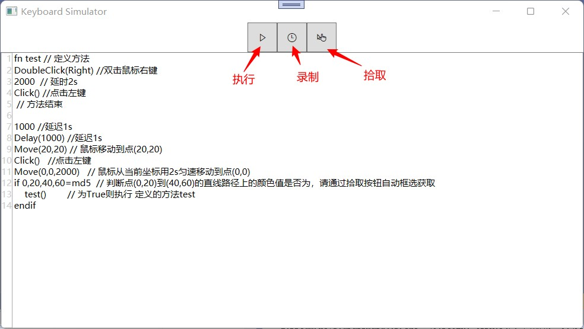

# ZoDream.KeyboardSimulator
 按键录制与回放

 ## 说明

 整合 [globalmousekeyhook](https://github.com/gmamaladze/globalmousekeyhook) 和 [InputSimulator](https://github.com/michaelnoonan/inputsimulator)  代码，基于`netstandard2.1`，并统一使用按键枚举，方便 `Net Core WPF` 调用

 ## 预览

 

 ## 已完成功能

1. 拾取
2. 录制
3. 模拟执行
4. `ctrl + O` 或拖拽文件进行打开脚本文件
5. `ctrl + s` 进行脚本保存
6. 基于`Lua`实现脚本功能

## 页面功能

1. 主界面：编辑、打开文件、保存文件、执行、日志输出
2. 录制界面：录制开关、暂停、停止插入代码
3. 拾取界面： 拾取坐标颜色，默认自动拾取鼠标，可以输入坐标拾取，也可以从图片拖动拾取释放的坐标；拾取区域颜色(IsRectColor用到)；拾取窗口句柄及窗口信息；坐标转化，支持文件批量转化，文件拖入原坐标输入框即可（转化关键词Move|MoveTo）
4. 设置界面：

## 示例

```lua

local hwn = FindWindow("UnityWndClass", "Game")
FocusWindow(hwn)
Delay(100)
local rect = GetClientRect(hwn)
SetBasePosition(rect[0], rect[1])
MoveTo(1111, 801)
Delay(1000)
if IsPixelColor(0, 0, "ffffff") == false
then
    Click()
end
```

[一个游戏测试脚本](examples/game.lua)

## 语法规则

请参考 [`lua`](http://www.lua.org/) 文档

[一些方法声明文件](src/ZoDream.KeyboardSimulator/snippet.lua)

|添加方法|说明|示例|
|:--|:--|:--|
|FindWindow(string className, string windowName): int|获取窗口句柄||
|FocusWindow(int hwnd)|激活窗口|
|GetWindowRect(int hwnd): int[left,top,width,height]|获取窗口的坐标，包括标题栏及外边框|
|GetClientRect(int hwnd): int[left,top,width,height]|获取窗口的坐标,不包括标题栏及外边框|
|SetBasePosition(int x, int y)|设置全局坐标，影响其他方法的 `x、y`|
|MoveTo(int x, int y)|移动鼠标到，受全局坐标影响|
|Move(int x, int y)|同上|
|MoveTween(int x, int y, int time)|慢慢移动到|
|Click(int count)|左击几次鼠标||
|Delay(int milliseconds)|延迟多少毫秒|
|MouseDown(string button)|按下鼠标, 默认`Left`，可选值`Left,Right,Middle,XButton1,XButton2`||
|MouseUp(string button)|释放鼠标||
|Scroll(int offset)|滚动滑轮|`Scroll(10)`|
|HotKey(...string[] keys)|输入组合键，支持0x或数字或按键名，数字为`VK`|`HotKey(0xA2,0x41)` 等于`HotKey(LeftCtrl,A)` |
|Input(string key)|输入按键，数字为直接作为 `scancode` 输入|`Input(A)` 等于 `Input(0x30)`|
|KeyDown(string key)|按下键，数字为直接作为 `scancode` 输入||
|KeyUp(string key)|释放键，数字为直接作为 `scancode` 输入||
|GetPixelColor(int x, int y)|获取某一点的颜色值|`GetPixelColor(0,0) => FF00CC`
|IsPixelColor(int x, int y, string color)|判断某一点的颜色值是否是|`IsPixelColor(0,0, "ff00cc"`|
|IsRectColor(int x, int y, int endX, int endY, string color)|判断某个区域是否是这个颜色值，请使用自带拾取工具获取||
|InColor(string color, string min, string max)|比较颜色的深度范围||
|RunExe(string fileName, string? args): bool|运行启动指定程序|`RunExe("explorer", "D:\\")`|
